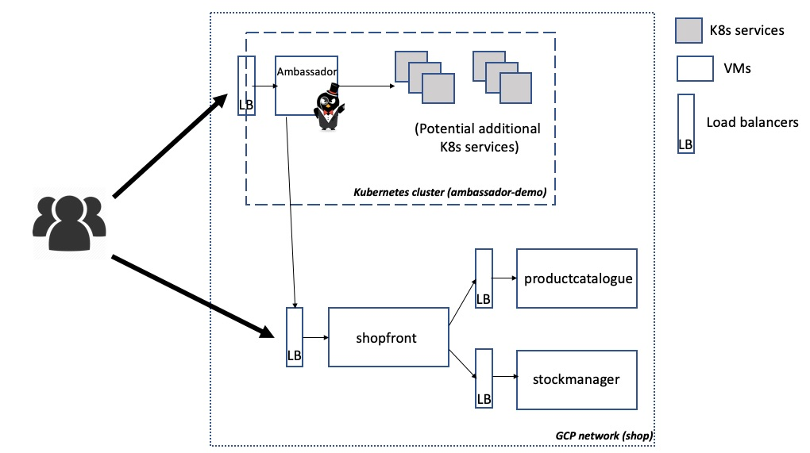
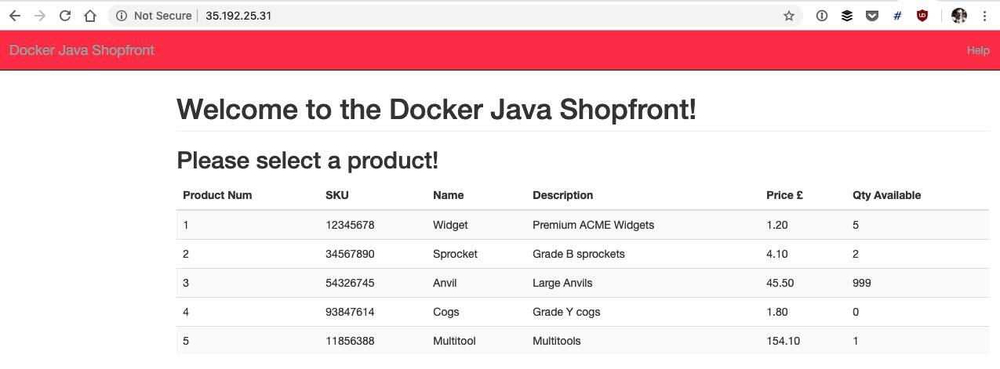
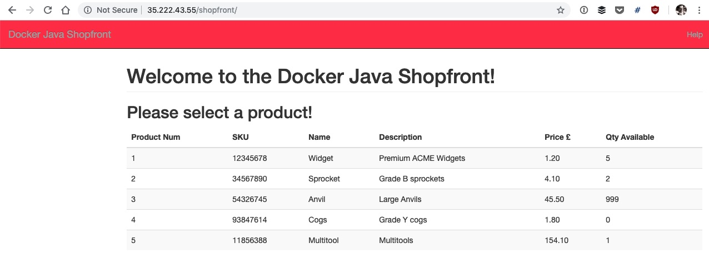

ambassador-vm-examples
======================

## Overview

Below is a network diagram of the infrastructure you will be deploying within this tutorial. By default you will deploy three VMs -- one for each of the Java services "shopfront", "productcatalogue", and "stockmanager" -- alongside a GKE hosted Kubernetes cluster. Several load balancers will also be created.



## Instructions

The following section of the doc will guide you through using Terraform to provision the example using Google Cloud Platform.

*Please note that this example instantiates several GCP resources, which will cost you money if you do not have free credit remaining*

### Create GCP account
If you do not already a [Google Cloud Platform account](https://cloud.google.com/), then please create one. Typically a new account comes with a specified amount of free credit, which will be useful for experimenting with this example. However, if you have used all of your free credit, then this example may cost several dollars to run.

### Install the "gcloud" CLI tool
Install the [GCP gcloud SDK/CLI tool](https://cloud.google.com/sdk/gcloud/) by following the instructions on the GCP website.

If you have already installed the gcloud CLI, please ensure that it is up to date: `$ sudo gcloud components update`

Ensure that the gcloud tool is [authenticated and configured](https://cloud.google.com/sdk/gcloud/reference/auth/login) to use your account.

### Install Terraform
Install [Terraform](https://www.terraform.io/downloads.html) according to the instructions for your platform. As an alternative, Terraform is also available via many OS package managers.

### Clone Repo and Initialize

Clone this repo and run the `terraform init` command to initialise the directory for further use with Terraform.

```
$ git clone git clone git@github.com:datawire/pro-ref-arch.git
$ cd pro-ref-arch/cloud-infrastructure/google-cloud-platform

$ terraform init
```

### Create SSH Credentials

You will be provisioning the compute instances via Terraform using SSH, and therefore you will require that a valid SSH key pair exists on your local machine. The private key will be securely added to the remote instance metadata during the creation via Terraform, and the public key will be used for authentication when provisioning.

If you do not already have a key pair created for use with GCP, you can follow the instructions within the ["Creating a new SSH key"](https://cloud.google.com/compute/docs/instances/adding-removing-ssh-keys#createsshkeys) section of the GCP docs.

### Configure Secrets and Credentials For Use Within Terraform

Create a file `secret-variables.tf` and add the following content, replacing the default placeholder values with your Google account details and SSH username and key information. *Note: Due to the secret nature of this information, please don't commit this file into version control!*

```
variable "project_id" {
  description = "The ID of your Google Cloud Platform project"
  default = "nodal-flagstaff-XXXX"
}

variable "ssh_username" {
  default = "root"
}

variable "public_key_path" {
  description = "Path to file containing public key"
  default     = "~/.ssh/gcp_instances.pub"
}

variable "private_key_path" {
  description = "Path to file containing private key"
  default     = "~/.ssh/gcp_instances"
}
```

### Create the Infrastructure

Run the following commands to create the infrastructure via Terraform.

First run `terraform plan` in order to check everything is configured correctly, and also to get a preview of the infrastructure that will be created.

```
$ terraform plan
```

If you see any errors in the output from the above command, please double-check that you have created your GCP account correctly, and also created the `secret-variables.tf` as specified above.

Next, create the infrastructure by running `terraform apply`. You can remove the need to confirm the creation by adding the `-auto-approve` flag.

```
$ terraform apply -auto-approve
```
Note: You may occasionally see the following error when provisioning "E: Package 'ca-certificates-java' has no installation candidate", and this can be overcome by running the `terraform apply -auto-approve` again

The creation of the infrastructure may take some time (~5 mins).

Upon successful execution of the command, you will see output similar to this:

```
Apply complete! Resources: 15 added, 0 changed, 0 destroyed.

Outputs:

gcloud_get_creds = gcloud container clusters get-credentials ambassador-demo --project nodal-flagstaff-XXXX --zone us-central1-f
shop_loadbalancer_ip_port = 35.192.25.31:80
shopfront_ambassador_config =
---
apiVersion: v1
kind: Service
metadata:
  name: shopfront
  annotations:
    getambassador.io/config: |
      ---
      apiVersion: ambassador/v1
      kind:  Mapping
      name:  shopfront_mapping
      prefix: /shopfront/
      service: 35.192.25.31:80
spec:
  ports:
  - name: shopfront
    port: 80

```

You can access the shopfront instance via the load balancer IP and port specified via the `shop_loadbalancer_ip_port` output e.g. http://35.192.25.31:80 in the above example



### Deploy Ambassador into Kubernetes

Configure your local `kubectl` via the `gcloud` tool, in order to be able to access the ambassador-demo cluster that was just created. The command to run is specified in the `gcloud_get_creds` output variable.

```
$ gcloud container clusters get-credentials ambassador-demo --project nodal-algebra-232111 --zone us-central1-f

Fetching cluster endpoint and auth data.
kubeconfig entry generated for ambassador-demo.

$ kubectl get svc
NAME         TYPE        CLUSTER-IP    EXTERNAL-IP   PORT(S)   AGE
kubernetes   ClusterIP   10.59.240.1   <none>        443/TCP   28m
```

You can now deploy Ambassador into the cluster using the [Getting Started](https://www.getambassador.io/user-guide/getting-started/) instructions in the Ambassador docs, or by running the commands below:

```
# Configure RBAC (enabled by default in GKS) for your account
$ kubectl create clusterrolebinding my-cluster-admin-binding --clusterrole=cluster-admin --user=$(gcloud info --format="value(config.account)")

clusterrolebinding.rbac.authorization.k8s.io/my-cluster-admin-binding created

# Install Ambassador with RBAC support
$ kubectl apply -f https://getambassador.io/yaml/ambassador/ambassador-rbac.yaml

service/ambassador-admin created
clusterrole.rbac.authorization.k8s.io/ambassador created
serviceaccount/ambassador created
clusterrolebinding.rbac.authorization.k8s.io/ambassador created
deployment.extensions/ambassador created

$ kubectl get svc
NAME               TYPE        CLUSTER-IP      EXTERNAL-IP   PORT(S)          AGE
ambassador-admin   NodePort    10.59.255.240   <none>        8877:30801/TCP   39s
kubernetes         ClusterIP   10.59.240.1     <none>        443/TCP          32m
```

Now you can deploy the `ambassador-service.yaml` configuration included in the k8s-config directory, which creates an Ambassador Service that is exposed via an external load balancer.

```
$ kubectl apply -f k8s-config/ambassador-service.yaml
service/ambassador created

# Wait several minutes for the Google load balancer to be created and an external IP address assigned
$ kubectl get svc

kubectl get svc
NAME               TYPE           CLUSTER-IP      EXTERNAL-IP    PORT(S)          AGE
ambassador         LoadBalancer   10.59.243.153   35.222.43.55   80:32186/TCP     1m
ambassador-admin   NodePort       10.59.255.240   <none>         8877:30801/TCP   3m
kubernetes         ClusterIP      10.59.240.1     <none>         443/TCP          35m
```

### Creating Ambassador Mapping to Route to External Services/Load Balancers

You can now add an Ambassador Mapping to the shopfront service you accessed earlier. This will allow you to access the shopfront via the Ambassador external IP and Kubernetes, rather than calling the shopfront load balancer directly.

The required Ambassador configuration was included as part of the Terraform apply output, and can be found in the `shopfront_ambassador_config` variable. Copy and paste this output to a new file named `shopfront.yaml` in the k8s-config directory.

For example, this is the output I copy/pasted into a newly created `k8s-config/shopfront.yaml` file.
```
---
apiVersion: v1
kind: Service
metadata:
  name: shopfront
  annotations:
    getambassador.io/config: |
      ---
      apiVersion: ambassador/v1
      kind:  Mapping
      name:  shopfront_mapping
      prefix: /shopfront/
      service: 35.192.25.31:80
spec:
  ports:
  - name: shopfront
    port: 80
```

Apply this config to your Kubernetes cluster:

```
$ kubectl apply -f k8s-config/shopfront.yaml

service/shopfront created
```

You can now access the shopfront via the Ambassador IP and mapping specified in the config. e.g. `http://35.222.43.55/shopfront/`



### Clean Up and Destroy Infrastructure

When you are finished with the tutorial, you can remove all of the infrastructure by using the `terraform destroy` command. You can add the `-force` flag is you want to skip the confirmation.

```
$ terraform destroy -force
```
